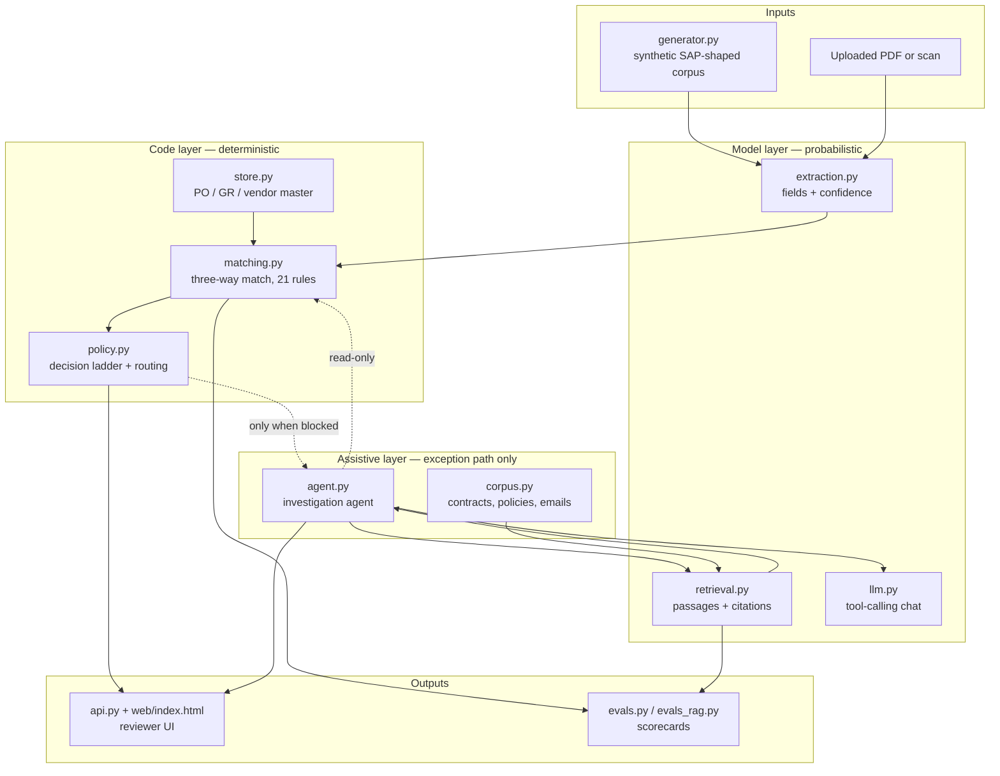
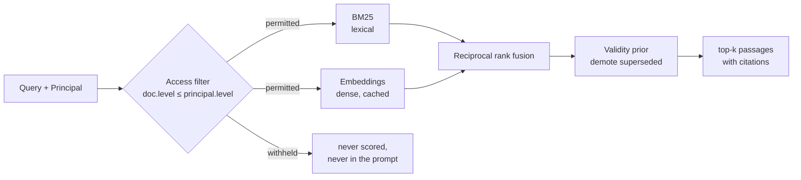
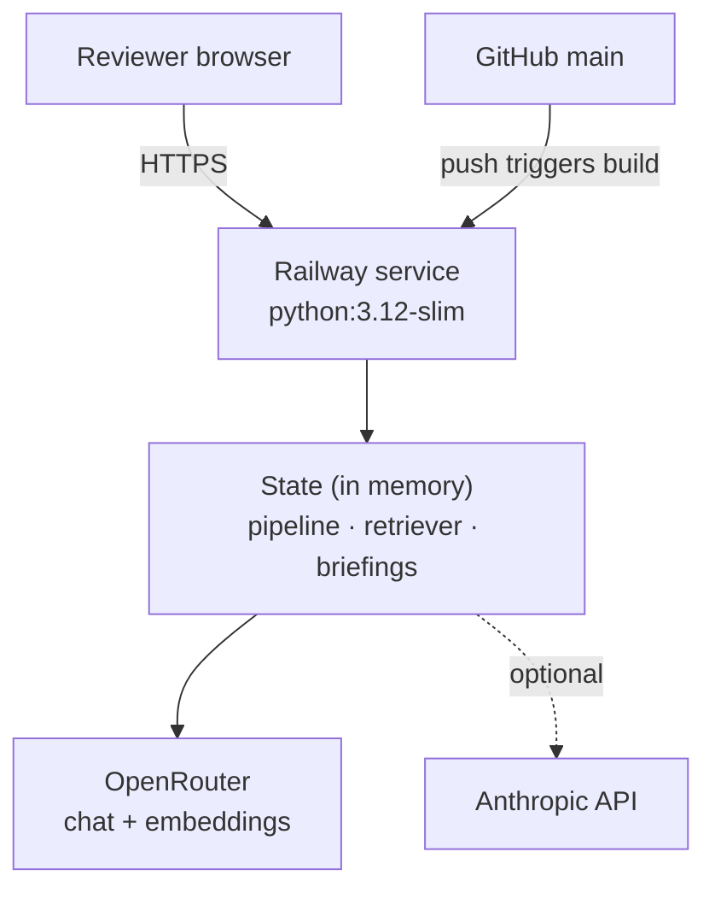

# Architecture

Invoice Match Desk checks every incoming supplier invoice against its purchase
order and its goods receipt, applies the company's approval policy, and hands
whatever fails to a reviewer with the numbers and the documents that explain
it.

About 6,700 lines of Python and one 1,150-line HTML file. No third-party
runtime dependencies — the standard library, `urllib` for HTTP, and
`reportlab` only to render sample PDFs.

---

## 1. The organising principle

One line runs through every layer of this system:

> **A language model reads. Code decides.**

A model is the right tool for pulling `148.50` off a smudged scan, and the
wrong tool for deciding whether `148.90` is within 3% of it. Everything in the
architecture follows from putting that boundary in one place and defending it.

| | Model | Code |
| --- | --- | --- |
| **Does** | Turn documents into fields with a confidence each; turn a question into retrieved passages; write a briefing | Compare, convert, sum, apply tolerances, route approvals |
| **Never** | Compares to a PO. Decides payability. Clears an exception | Guesses at a smudged glyph |
| **Property** | Probabilistic, improves with better prompts and models | Deterministic, reproducible, auditable |

The practical test: **swapping the model provider must not require touching
`matching.py` or `policy.py`.** If it ever does, the boundary has leaked.

---

## 2. Component map



### Module responsibilities

| Module | Lines | Responsibility |
| --- | ---: | --- |
| `models.py` | 535 | Domain types, `Decimal` money, the 21-rule exception catalogue |
| `config.py` | 211 | Tolerance keys, approval ladder, unit-of-measure dimensions |
| `generator.py` | 857 | Synthetic SAP-shaped corpus with labelled failure cases |
| `documents.py` | 168 | Render an invoice to text or PDF, so extraction has real input |
| `extraction.py` | 595 | **The model boundary.** Fields plus confidence, nothing else |
| `store.py` | 156 | Read model over master data; vendor resolution, duplicate ledger |
| `matching.py` | 521 | **The three-way match engine.** All arithmetic, no model |
| `policy.py` | 122 | Decision ladder, approval routing, payable amount |
| `pipeline.py` | 132 | Orchestration and per-stage latency |
| `ingest.py` | 136 | Uploaded PDFs through the same engine as the corpus |
| `corpus.py` | 612 | Contracts, rate cards, policies, correspondence, disputes |
| `retrieval.py` | 523 | Chunking, BM25, embeddings, fusion, **the access filter** |
| `llm.py` | 243 | Tool-calling chat over both providers |
| `agent.py` | 427 | The investigation agent and its read-only tools |
| `evals.py` | 340 | Extraction scored apart from decisions |
| `evals_rag.py` | 391 | Retrieval scored apart from grounding; the permission audit |
| `api.py` | 436 | HTTP service on `http.server` |
| `cli.py` | 266 | Command line |

---

## 3. The three boundaries

Each one is a deliberate seam, testable from the outside.

### 3.1 Extraction ↔ matching

`extraction.py` returns an `Invoice` with a **confidence per field**. That is
the entire contract. It never sees a purchase order.

Three interchangeable backends behind one `ModelExtractor` base:

| Backend | Used for | Needs |
| --- | --- | --- |
| `MockExtractor` | Development, tests, regression runs. Offline, reproducible, deliberately imperfect | nothing |
| `AnthropicExtractor` | Real documents via the Claude Messages API | `ANTHROPIC_API_KEY` |
| `OpenRouterExtractor` | The same models billed through OpenRouter | `OPENROUTER_API_KEY` |

The two model backends differ **only** in transport and in how a file is
packaged. Prompt, JSON contract and parsing are shared, because which company
bills you for the tokens is a delivery detail. A test asserts both produce a
byte-identical `Invoice` from an identical model reply.

Confidence carries the handover: below `field_confidence_threshold` on a
decision-critical field, the document routes to a human rather than being
trusted.

### 3.2 Matching ↔ policy

`matching.py` answers *is this invoice consistent with the PO and the GR?* —
the same question in every company. `policy.py` answers *what do we do about
it, and who signs?* — a configuration choice finance changes without a release.

The payable amount is computed from the PO price and the justified quantity.
**Never from the invoice's own total.**

### 3.3 Deterministic core ↔ assistive agent

The agent reads the match result through a tool. There is no tool that writes
one. Every tool name begins `get_`, `search_` or `read_`, and a test asserts
the set contains nothing else.

---

## 4. Retrieval architecture



Four decisions define this layer:

1. **The filter runs before scoring.** A passage above the principal's
   clearance is never ranked, so it can never enter the prompt. Filtering the
   *answer* is too late — the confidential text has already been in the context
   window, and "the model was told not to repeat it" is not an access control.

2. **BM25 is written out, not imported.** Term frequency saturates, long
   passages are penalised, rare terms weigh more. Clause numbers and document
   ids survive tokenisation intact, because on contract text the clause number
   is often the entire query.

3. **Fusion by rank, not by score.** A BM25 score and a cosine similarity are
   not on the same scale; normalising them is a fudge that breaks on the next
   corpus. Reciprocal rank fusion combines positions instead.

4. **Chunks split at the document's own seams** — contracts at clause numbers,
   email threads at message boundaries — and carry their heading into the
   index. Retrieval quality on contract text is mostly a chunking problem.

Embeddings come from OpenRouter and are cached on disk by content hash, which
makes runs reproducible as well as cheap. Without a key the dense half is
skipped and the system reports `lexical` rather than implying it did hybrid
retrieval.

### The access model

```
ap_clerk (1)  <  ap_manager (2)  <  finance_controller (3)  <  legal (4)
```

Every document carries `access_level` and `shareable`. The second drives a
warning in the briefing: material marked not shareable must not be quoted to
the supplier. A forbidden document is made **indistinguishable from a missing
one** — telling a clerk that a legal note about this vendor exists is itself a
disclosure.

---

## 5. Runtime topology



- One container. `PORT` injected by Railway; `/api/health` is the health check.
- The build runs all 84 tests — a broken match engine fails the deploy rather
  than shipping.
- Tests execute at build time, so a deployed image is one that passed.

### State model

Everything is in memory, and that is a deliberate trade for a demo:

| State | Lifetime | Note |
| --- | --- | --- |
| Corpus run (50 invoices) | Rebuilt on boot and on policy change | Deterministic, ~0.15 ms/invoice |
| Retriever index | Built once on boot | Survives policy changes — tolerances have nothing to do with contracts |
| Uploaded invoices | Until restart | Re-matched on policy change, **never re-extracted** |
| Briefings | Cached per `(doc_id, role)` | Re-run on demand |
| Embedding cache | Per container | Re-embedded after each deploy (33 chunks, negligible) |

A Railway redeploy clears uploads and reviewer actions. The fix for anything
real is a database behind `store.py` and `State` — which is exactly where that
seam already sits.

---

## 6. HTTP surface

| Method | Route | Purpose |
| --- | --- | --- |
| GET | `/` | Reviewer UI |
| GET | `/api/health` | Liveness, and which capabilities are enabled |
| GET | `/api/queue` | Every processed invoice, summarised |
| GET | `/api/invoice/<id>` | One invoice with PO and GR evidence and trace |
| GET | `/api/summary` | Throughput and benefit figures |
| GET | `/api/evals` | Match evaluation report |
| GET | `/api/rag-evals` | Retrieval evaluation and permission audit |
| GET | `/api/corpus?role=` | Documents visible to a role |
| GET | `/api/search?q=&role=` | Permission-filtered search |
| GET | `/api/sample/<id>.pdf` | Render a corpus invoice as a PDF |
| POST | `/api/upload` | Raw PDF body, `X-Filename` header |
| POST | `/api/investigate` | Run the agent for one invoice as one role |
| POST | `/api/policy` | Change tolerances and re-run |
| POST | `/api/decision` | Record a reviewer action |

The handlers are a thin shell over `State`. Putting FastAPI or an API gateway
in front is a file-sized change — nothing above that layer knows `http.server`
is there.

---

## 7. What this architecture buys

- **Auditability.** A decision is reproducible from the invoice, the PO, the
  GR and the policy. Nothing probabilistic sits in the decision path.
- **Provider independence.** Three extraction backends, two chat backends, one
  contract each.
- **Honest failure.** Every capability that needs a key reports whether it has
  one. Nothing silently degrades.
- **Testability at the seams.** 84 tests, including assertions on what the
  system *cannot* do: leak a document, or move a verdict.

## 8. What it does not do

- No write-back to an ERP. Decisions are computed, not posted.
- Single company code and currency; no cross-company or FX revaluation.
- No persistence. See the state table above.
- Vendor resolution is name-based with a fuzzy fallback that refuses ambiguous
  matches. A real deployment resolves on more than a name.
