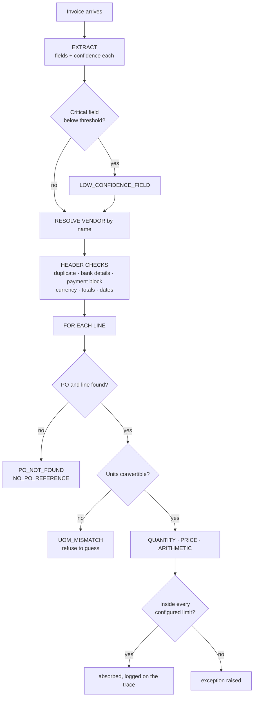
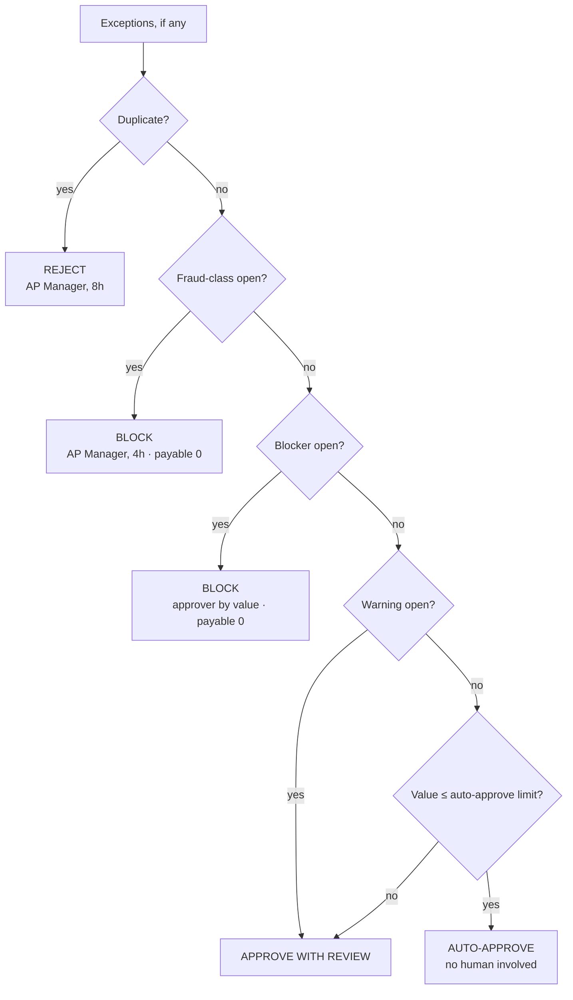
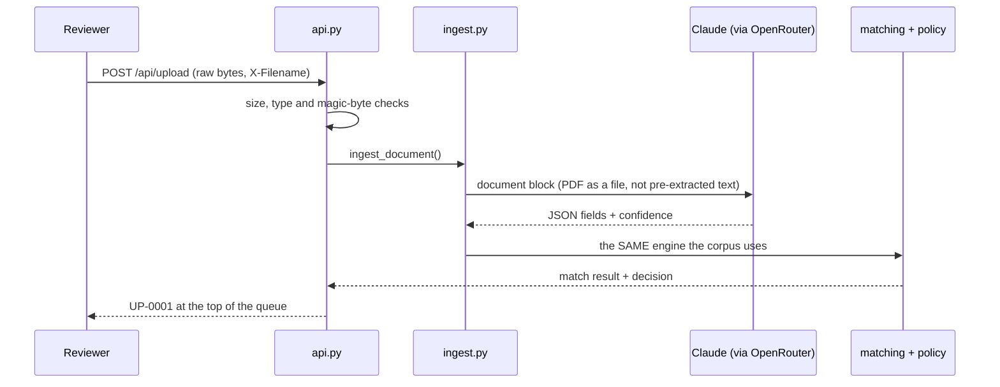
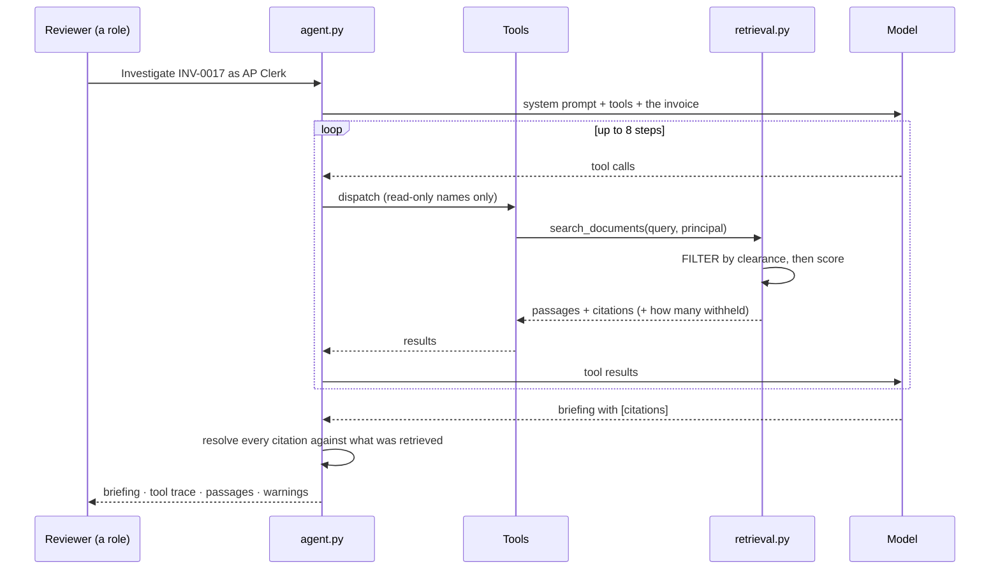
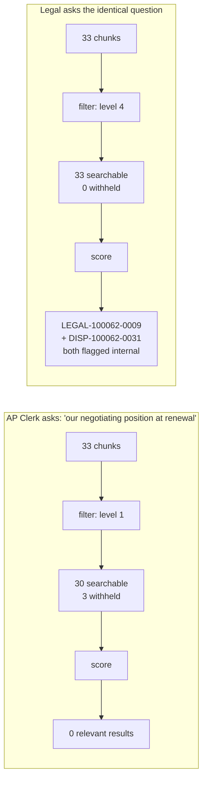
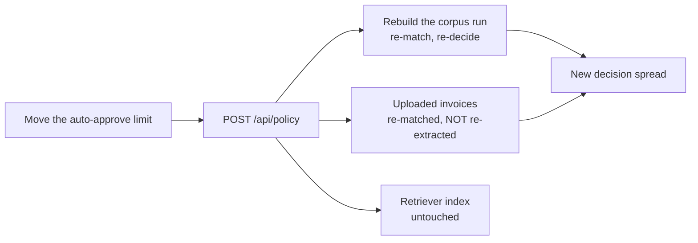

# Process flows

Five flows. The first is the one everything else hangs off.

---

## 1. Invoice to decision

The main path. Runs in about 0.15 ms per invoice on the synthetic corpus,
because after extraction there is no model in it.

### 1a · What gets checked



The three line checks in one box above are where the work is:

| Check | Compares |
| --- | --- |
| **Quantity** | invoiced **+ previously invoiced** against **net** received (goods receipts minus reversals), then against ordered + over-delivery tolerance |
| **Price** | invoice unit price against `EKPO-NETPR / PEINH`, converted into the PO's unit |
| **Arithmetic** | quantity × unit price against the printed line amount |

### 1b · What happens to it




**Three things worth noticing.**

The quantity check is *cumulative*. A supplier who invoices 80%, then 50%, is
caught only by tracking across documents — neither invoice exceeds the receipt
on its own.

Tolerance is checked after each comparison, not at the end. A variance inside
every configured limit is absorbed and written to the trace rather than
suppressed, so the reviewer can see what was waved through.

The policy ladder is ordered by consequence, not by value. Value is the last
question asked, and for fraud-class exceptions it is never asked at all.

---

## 2. Reading a real PDF



The validation order matters: an empty file, a wrong type or a `.pdf` that
does not start with `%PDF` is refused **before** the API call, so a malformed
upload costs nothing.

PDFs go up as a file, not as text extracted beforehand — so a scan with no text
layer reads the same way a born-digital PDF does.

Uploaded documents are **never scored in the evaluation**. Nobody labelled
them, and an unlabelled document in the eval set is how a scorecard starts
lying to you.

---

## 3. Investigating an exception

The agent loop. Runs only on invoices that were stopped.



**Post-hoc checks**, run on what the model actually produced:

| Check | Shown as |
| --- | --- |
| Citation resolves to a retrieved passage | normal |
| Citation resolves to nothing retrieved | struck through, with a warning |
| Any passage marked `shareable: false` | "internal material used — do not quote to the supplier" |
| Passages withheld by clearance | counted in the header |

The verdict is untouched throughout. The agent read it; it cannot write it.

---

## 4. Permission-filtered retrieval

The same query, two roles. This is the flow the whole access model exists for.



The clerk is not told the document exists. `read_document` on a forbidden id
returns exactly what a nonexistent id returns.

Try it without spending a token:

```bash
python3 -m app.cli ask "what is our negotiating position at renewal" --role ap_clerk
python3 -m app.cli ask "what is our negotiating position at renewal" --role legal
```

---

## 5. Changing policy



Three deliberate behaviours:

- Uploaded invoices are re-matched but never re-extracted — that would spend an
  API call to read a document that has not changed.
- The retriever is untouched: tolerances have nothing to do with what the
  contracts say.
- Non-waivable rules ignore the slider entirely. Raising the limit to a million
  still blocks a duplicate and a bank-detail change.

---

## Exception catalogue

21 rules, each with a severity that determines routing.

| Severity | Meaning | Routes to |
| --- | --- | --- |
| `fraud` | Payment-integrity failure | Blocked or rejected, AP Manager, 4–8h |
| `blocker` | Cannot pay as presented | Blocked, approver by value |
| `warning` | Payable, needs a signature | Approve with review |
| `info` | Context only | Not an exception |

| Code | Severity | Fires when |
| --- | --- | --- |
| `DUPLICATE_INVOICE` | fraud | Same vendor + invoice number, or same vendor/date/amount, already posted |
| `BANK_ACCOUNT_CHANGED` | fraud | Remittance details differ from the vendor master |
| `VENDOR_BLOCKED` | blocker | Payment block on the vendor master |
| `VENDOR_MISMATCH` | blocker | Invoicing party is not the PO vendor, or cannot be resolved |
| `PO_NOT_FOUND` | blocker | The PO number does not exist |
| `PO_LINE_NOT_FOUND` | blocker | The item number does not exist on that PO |
| `PO_DELETED` | blocker | PO line flagged for deletion |
| `NO_PO_REFERENCE` | blocker | No PO on the line at all |
| `GR_MISSING` | blocker | GR-based verification active, nothing received |
| `QTY_EXCEEDS_GR` | blocker | Cumulative invoiced > net received |
| `QTY_EXCEEDS_PO` | blocker | Cumulative invoiced > ordered + over-delivery tolerance |
| `UOM_MISMATCH` | blocker | Units not convertible |
| `PRICE_VARIANCE` | blocker | Unit price outside the price tolerance |
| `CURRENCY_MISMATCH` | blocker | Invoice currency ≠ PO currency |
| `HEADER_TOTAL_MISMATCH` | blocker | Gross ≠ sum of lines + tax |
| `LINE_MATH_ERROR` | blocker | Line amount ≠ qty × price |
| `MISSING_FIELD` | blocker | A field required to post is absent |
| `TAX_CODE_INVALID` | warning | Tax code outside the allowed set |
| `DATE_ANOMALY` | warning | Future-dated, or predates the goods receipt |
| `LOW_CONFIDENCE_FIELD` | warning | A decision-critical field read below threshold |
| `UNDER_DELIVERY` | info | Partial delivery — expected, not flagged |
